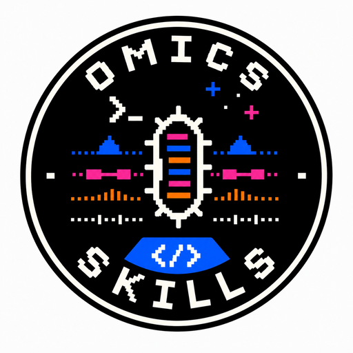

<p align="center">
  
</p>

A skill and agent pack for omics data analysis, literature discovery, scientific writing, and data visualization. Runs under Claude Code and the Codex CLI.

## Documentation

The MkDocs documentation site is configured for GitHub Pages at <https://fmschulz.github.io/omics-skills/>. It includes a getting-started guide, agent overview, full skill catalog, routing guide, and development notes.

Source pages live in [`docs/`](docs/), the site is configured by [`mkdocs.yml`](mkdocs.yml), and the deployment workflow is in [`.github/workflows/pages.yml`](.github/workflows/pages.yml).

## Scope

Four agent personas — `omics-scientist`, `literature-expert`, `science-writer`, `dataviz-artist` — compose a set of small, single-purpose skills (`SKILL.md` files) for tasks ranging from read QC through assembly, gene calling, annotation, phylogenomics, comparative genomics, structure prediction, viromics, statistics, manuscript drafting, and figure generation.

Agents are markdown system prompts; skills are markdown files with a defined input/output contract. A deterministic router (`scripts/skill_index.py`) picks an agent and an ordered set of skills for a given task and can be enabled as a hook so it runs on every user prompt.

## How analyses are run

Rather than an open-ended toolbox, the bio-* skills enforce a short set of conventions:

- **Hypothesis register.** Exploratory work starts with at least five working hypotheses (biological mechanism, technical artifact, null, sampling or batch effect, database artifact). Each is revised as supported, weakened, ruled out, or unresolved, with the evidence that changed its status.
- **Reflection after each step.** After each major result or QC gate, the agent records what was observed, which hypotheses gained or lost support, and the next discriminating check.
- **Literature-derived analysis plan.** Before deciding what is "interesting" the agent reads the literature for the inferred group and summarises which markers, comparison sets, plots, and outliers are diagnostic.
- **Comparative axes against close relatives.** When relatives are available, the query is run through five axes — genome-property frontier, marker-gene census, per-family copy-number, synteny and conserved neighborhoods, and non-coding RNA census — each producing a side-by-side comparison file.
- **Literature search with fallbacks.** `polars-dovmed` queries PMC and bioRxiv through the hosted API, falls back to a local parquet `dovmed scan`, and finally to targeted `WebFetch` / `WebSearch` so endpoint outages do not silently skip the literature step.

## Tooling baseline

Skills target current stable releases as of 2026 and document GPU alternatives where they exist.

| Step | CPU baseline | GPU alternative |
|---|---|---|
| Read trimming (long) | Porechop_ABI, Pychopper | — |
| Read mapping (short) | bwa-mem2, BBMap | NVIDIA Parabricks `fq2bam` |
| Read mapping (long) | minimap2 v2.30 | `mm2-fast` (AVX-512), `mm2-gb`, `mm2-ax` |
| Assembly | SPAdes 4 (Illumina), Flye 2.9 (long-read), metaMDBG 1.1 (HiFi metagenome), myloasm (optional) | — |
| Domain taxonomy triage | BBTools QuickClade via `bryce911/bbtools` container (`percontig` for assemblies), then GTDB-Tk / EukCC / vConTACT3 / GVClass by domain | — |
| Binning | QuickBin via `bryce911/bbtools` container | SemiBin2 v2.2.1 (CUDA-backed PyTorch) |
| Bin QC | CheckM2 v1.1.0, EukCC v2.1.3, GUNC v1.0.6 | — |
| Gene calling | pyrodigal, pyrodigal-gv, BRAKER3 | — |
| ncRNA | tRNAscan-SE v2.0.12, Infernal v1.1.5 (`cmsearch` against Rfam SSU/LSU CMs) | — |
| Annotation | DIAMOND v2.1.20+ (clusterednr preferred), eggNOG-mapper v2.1.13, InterProScan v5.77, pyhmmer, TaxonKit v0.20 | MMseqs2-GPU |
| Phylogenetics | VeryFastTree v4 (exploratory/time-bounded trees and >2,000 taxa), IQ-TREE v3.1.2 (final ≤2,000 taxa), MAFFT, trimAl, ete4 | — |
| Orthology / pangenome | OrthoFinder v3, ProteinOrtho v6 (large pangenomes), MMseqs2 | MMseqs2-GPU |
| Synteny | MCScanX, ntSynt, SibeliaZ | — |
| Viromics | geNomad, CheckV, VirSorter2, vConTACT3 (prokaryotic-virus taxonomy), gvclass (Nucleocytoviricota) | — |
| Structure | TM-Vec (triage), Boltz-2 (default predictor), ColabFold + MMseqs2-GPU MSA, ESMFold (pre-screen), Foldseek v9 | Boltz-2, Foldseek v9 `--gpu 1`, ColabFold, ESMFold |
| Statistics / ML | DuckDB v1.1, scikit-learn, XGBoost v2.1 | XGBoost `device=cuda`, RAPIDS cuML |

The full survey of versions, alternatives, and benchmarks is in [`docs/tooling-survey-2026.md`](docs/tooling-survey-2026.md).

## Installation

```bash
git clone https://github.com/fmschulz/omics-skills.git
cd omics-skills
make install
```

`make install` builds the routing catalog and symlinks agents and skills into `~/.claude/` and `~/.codex/`. Use `make install-claude` or `make install-codex` for a single runtime, `make install INSTALL_METHOD=copy` for copies instead of symlinks, and `make status` to report what is installed. See [INSTALL.md](INSTALL.md) for troubleshooting.

The routing hook attaches the router to every user prompt:

```bash
make install-hook        # Claude Code + Codex CLI
make hook-status
make uninstall-hook
```

Set `OMICS_SKILLS_AUTOROUTE=0` to suppress the hint for a session without uninstalling.

## Usage

```bash
claude --agent omics-scientist
codex --system-prompt ~/.codex/agents/omics-scientist.md
```

Query the router directly:

```bash
python3 scripts/skill_index.py route \
  "assemble a metagenome and recover MAGs"
```

Skills are also invocable individually as `/<skill-name>`. Agent files list the skills each agent exposes and how they compose.

## Agents

| Agent | Focus | Skills |
|---|---|---:|
| `omics-scientist` | Sequencing reads, assembly, binning, annotation, phylogenomics, MAG recovery, JGI access | 16 |
| `literature-expert` | PMC full text, arXiv and bioRxiv preprints, DOI metadata, citation impact | 7 |
| `science-writer` | Manuscript drafting, multi-reviewer critique, proposal review, AI-output evaluation | 7 |
| `dataviz-artist` | marimo and Jupyter notebooks (executed end-to-end), matplotlib/seaborn figures, Plotly Dash dashboards | 4 |

Run `python3 scripts/skill_index.py route --agent <agent> "<task>"` to see how a specific agent routes a given task.

## Repository layout

```
agents/                     4 agent definitions
skills/                     skill directories; each has a SKILL.md
catalog/                    generated router artifacts (catalog, relationships, routing)
scripts/
  skill_index.py            router and catalog builder
  routing_benchmark.py      regression harness
  emit_routing_hint.py      hook payload generator
  install_hook.py           idempotent hook installer
  install.sh                shell-script install (Makefile-free)
  uninstall.sh, test-install.sh, validate-skills.py
tests/
  test_skill_index.py       unit tests for catalog and router
  test_routing_benchmark.py harness sanity tests
  test_emit_routing_hint.py hook-script tests
  routing_benchmark.yaml    routing regression suite
docs/
  ROUTING_IMPROVEMENTS.md   per-PR router deltas
  SKILL_GRAPH.md            routing model and graph
  routing_baseline.json     benchmark baseline
  tooling-survey-2026.md    bioinformatics tooling survey
Makefile                    install, catalog, hook, benchmark, uninstall targets
```

## Development

```bash
python3 -m unittest discover tests              # unit tests
make benchmark                                  # routing regression vs baseline
python3 scripts/skill_index.py build            # rebuild catalog artifacts
```

Adding or modifying a skill:

1. Create or edit `skills/<name>/SKILL.md`. The YAML `name` field must match the directory name.
2. Add the skill to the relevant agent's `Mandatory Skill Usage` and `Task Recognition Patterns`.
3. Rebuild the catalog and run the test suite.
4. Add a benchmark row in `tests/routing_benchmark.yaml` if the skill is non-trivially discoverable by the router.

See [AGENTS.md](AGENTS.md) for structural conventions, [docs/SKILL_GRAPH.md](docs/SKILL_GRAPH.md) for how the router scores and composes skills, and [docs/skills.md](docs/skills.md) for the public skill catalog.

## Compatibility

| Platform | Notes |
|---|---|
| Claude Code | Agents in `~/.claude/agents/`; skills in `~/.claude/skills/`. |
| Codex CLI | Agents in `~/.codex/agents/`; skills in `~/.codex/skills/`; hook uses `~/.codex/hooks.json` with `[features] codex_hooks = true` in `~/.codex/config.toml`. |
| Claude API | Agent markdown files load directly as system prompts; skill files are readable as reference. |

## License

MIT. See [LICENSE](LICENSE).
