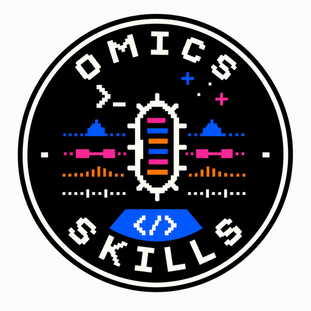

<p align="center">
  
</p>

<p align="center">
  <a href="https://github.com/fmschulz/omics-skills/releases">
    
  </a>
  <a href="https://github.com/fmschulz/omics-skills/actions/workflows/ci.yml">
    
  </a>
</p>

A skill and agent pack for omics data analysis, literature discovery, scientific writing, and data visualization. Works with Claude Code and the Codex CLI.

## Documentation

Read the docs at <https://fmschulz.github.io/omics-skills/>. They cover installation, the agent set, the skill catalog, routing, and development.
Release notes are published on the [GitHub Releases page](https://github.com/fmschulz/omics-skills/releases).

## Scope

Four agent personas — `omics-scientist`, `literature-expert`, `science-writer`, `dataviz-artist` — compose a set of small, single-purpose skills (`SKILL.md` files) for tasks ranging from read QC through assembly, gene calling, annotation, phylogenomics, comparative genomics, structure prediction, viromics, interdomain HGT, statistics, manuscript drafting, and figure generation.

The canonical agent sources are Markdown prompts. Installation keeps those files for Claude Code and renders native TOML agent definitions for Codex. Skills are Markdown directories with defined input/output contracts. A deterministic router (`scripts/skill_index.py`) picks an agent and an ordered set of skills for a task.

## How Analyses Are Run

Every skill can be used on its own. The bio-* skills also share a few habits that make exploratory analyses easier to audit and reproduce:

- **Hypothesis register.** Exploratory work starts with at least five working hypotheses (biological mechanism, technical artifact, null, sampling or batch effect, database artifact). Each is revised as supported, weakened, ruled out, or unresolved, with the evidence that changed its status.
- **Reflection after each step.** After each major result or QC gate, the agent records what was observed, which hypotheses gained or lost support, and the next discriminating check.
- **Literature-derived analysis plan.** Before deciding what is "interesting" the agent reads the literature for the inferred group and summarises which markers, comparison sets, plots, and outliers are diagnostic.
- **Comparative axes against close relatives.** When relatives are available, the query is run through five axes — genome-property frontier, marker-gene census, per-family copy-number, synteny and conserved neighborhoods, and non-coding RNA census — each producing a side-by-side comparison file.
- **Literature search with fallbacks.** When users provide API access or local corpora, `polars-dovmed` queries PMC and bioRxiv through the hosted API or a local parquet `dovmed scan`, then falls back to targeted `WebFetch` / `WebSearch` so endpoint outages do not silently skip the literature step.

## Tooling baseline

Skills target current stable releases as of 2026 and document GPU alternatives where they exist. The per-step table of pinned versions lives in [`docs/tooling-survey-2026.md`](docs/tooling-survey-2026.md); each skill's `docs/` directory carries the provenance-checked release notes for its own tools.

## Installation

### Claude Code / Cowork Plugin Marketplace

This repository is packaged as a Claude Code / Cowork plugin marketplace. To test the marketplace directly from GitHub:

```bash
claude plugin marketplace add fmschulz/omics-skills
claude plugin install omics-skills@omics-skills
```

To test a local checkout before submitting or publishing changes:

```bash
claude plugin validate .
claude plugin marketplace add ./
claude plugin install omics-skills@omics-skills
```

After Anthropic approves the community marketplace submission, users can install it from the public Claude plugin catalog.

### Codex Plugin Marketplace

The repository also includes a native Codex plugin manifest and repo marketplace:

```bash
codex plugin marketplace add fmschulz/omics-skills
codex plugin add omics-skills@omics-skills
```

For a local checkout, replace `fmschulz/omics-skills` with `.`. Run `codex plugin list --available --json` to inspect the resolved plugin before installing it.

### Makefile

```bash
git clone https://github.com/fmschulz/omics-skills.git
cd omics-skills
make install
```

`make install` builds the routing catalog, installs skills under `~/.agents/skills`, symlinks the Claude agent sources, and renders Codex agents as TOML. Use `make install-claude` or `make install-codex` for one runtime, `make install INSTALL_METHOD=copy` for copied skills, and `make status` to inspect the result. Re-run the installer after changing an agent prompt because generated Codex TOML files cannot track Markdown changes through a symlink. See [docs/INSTALL.md](docs/INSTALL.md) for troubleshooting.

The routing hook attaches the router to every user prompt:

```bash
make install-hook        # Claude Code + Codex CLI
make hook-status
make uninstall-hook
```

Set `OMICS_SKILLS_AUTOROUTE=0` to suppress the hint for a session without uninstalling.

## Usage

```bash
claude --agent omics-scientist
codex
```

In Codex, ask the primary agent to delegate to `omics-scientist`, or invoke a skill explicitly with `$bio-annotation`. The installed TOML definitions under `~/.codex/agents/` are available to Codex as custom subagents.

Query the router directly:

```bash
python3 scripts/skill_index.py route \
  "assemble a metagenome and recover MAGs"
```

Skills are also invocable individually as `/<skill-name>` in Claude Code or `$<skill-name>` in Codex. Agent files list the skills each agent exposes and how they compose.

## Agents

| Agent | Focus | Skills |
|---|---|---:|
| `omics-scientist` | Project reproducibility, sequencing reads, assembly, binning, annotation, phylogenomics, interdomain HGT, MAG recovery, public database records | 21 |
| `literature-expert` | PMC full text, arXiv and bioRxiv preprints, DOI metadata, and citation impact | 8 |
| `science-writer` | Manuscript drafting, multi-reviewer critique, proposal review, and AI-output evaluation | 8 |
| `dataviz-artist` | marimo and Jupyter notebooks, scientific data inspection, matplotlib/seaborn figures, and Plotly Dash dashboards | 4 |

Run `python3 scripts/skill_index.py route --agent <agent> "<task>"` to see how a specific agent routes a given task.

## Repository layout

```
agents/                     agent definitions
skills/                     skill directories; each has a SKILL.md
catalog/                    generated router artifact (catalog.json)
Makefile                    the installer: install, uninstall, status, validate
scripts/
  skill_index.py            router and catalog builder
  routing_benchmark.py      regression harness
  emit_routing_hint.py      hook payload generator
  install_hook.py           idempotent hook installer
  render_codex_agent.py     Markdown agent -> Codex TOML
  prune_removed_skills.py   retire skills dropped from the checkout
  validate-skills.py, validate-supplementary-docs.py, validate-citations.py
tests/
  test_skill_index.py       unit tests for catalog and router
  test_install_selected.py  selected-install and uninstall integration tests
  test_routing_benchmark.py harness sanity tests
  test_emit_routing_hint.py hook-script tests
  routing_benchmark.yaml    routing regression suite
docs/
  INSTALL.md                 detailed installation and troubleshooting guide
  CONTRIBUTING.md            contribution workflow
  DISTRIBUTION.md            distribution and discovery notes
  SKILL_GRAPH.md            routing model and graph
  routing_baseline.json     benchmark baseline
  tooling-survey-2026.md    bioinformatics tooling survey
Makefile                    install, catalog, hook, benchmark, uninstall targets
```

## Development

```bash
uv run --no-project --with pytest --with requests --with PyYAML python -m pytest tests -q
make benchmark                                  # routing regression vs baseline
python3 scripts/skill_index.py build            # rebuild catalog artifacts
```

Adding or modifying a skill:

1. Create or edit `skills/<name>/SKILL.md`. The YAML `name` field must match the directory name.
2. Add the skill to the relevant agent's `Mandatory Skill Usage` and `Task Recognition Patterns`.
3. Rebuild the catalog and run the test suite.
4. Add a benchmark row in `tests/routing_benchmark.yaml` if the skill is non-trivially discoverable by the router.

See [AGENTS.md](AGENTS.md) for structural conventions, [docs/SKILL_GRAPH.md](docs/SKILL_GRAPH.md) for how the router scores and composes skills, [docs/CONTRIBUTING.md](docs/CONTRIBUTING.md) for contribution flow, and [docs/skills.md](docs/skills.md) for the public skill catalog.

## Compatibility

| Platform | Notes |
|---|---|
| Claude Code | Agents in `~/.claude/agents/`; skills in `~/.claude/skills/`. |
| Codex CLI | TOML subagents in `~/.codex/agents/`; canonical skills in `~/.agents/skills/` with a legacy `~/.codex/skills` link; native plugin metadata in `.codex-plugin/`. |
| Claude API | Agent markdown files load directly as system prompts; skill files are readable as reference. |

## License

MIT. See [LICENSE](LICENSE).
